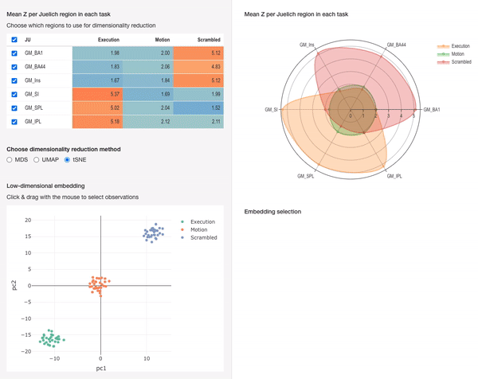

```{r setup, include=FALSE}
knitr::opts_chunk$set(echo = TRUE)
```


# Pippero



# The app

```{r echo=FALSE}
knitr::include_app("http://psaraki.xyz:3838/neuroimaging_dimred/", height = 2000)
```


